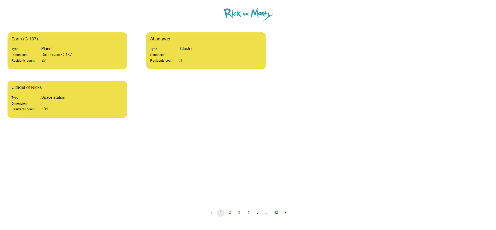

# Rick and Morty Project

## Description

In this project, I wanted to introduce the locations and characters of the Rick and Morty cartoon.

## Project Skeleton


```
Rick and Morty Project (folder for redux)

|----readme.md     
SOLUTION
├── src
|    ├── index.js
|    ├── App.scss
|    ├── App.tsx
|    ├── app
|    │   └── store.tsx
|    ├── assets
|    │   ├── grey.jpg
|    │   ├── randm.png
|    ├── components
|    │   ├── buttons
|    │   │   ├── FiltersBtn.scss
|    │   │   └── FiltersBtn.tsx
|    │   ├── Cards
|    │   │   ├── Cards.scss
|    │   │   |── Cards.tsx
|    │   │   ├── CharCards.scss
|    │   │   |── CharCards.tsx
|    │   │   ├── CharCardsDet.scss
|    │   │   |── CharCardsDet.tsx
|    │   │   ├── CharCardsFilter.tsx
|    │   │   ├── CharRightCards.scss
|    │   │   └── CharRightCards.tsx
|    │   ├── main
|    │   │   ├── CharDetMain.scss
|    │   │   ├── CharDetMain.tsx
|    │   │   ├── CharMain.scss
|    │   │   ├── CharMain.tsx
|    │   │   ├── Main.scss
|    │   │   └── Main.tsx
|    │   ├── navbar
|    │   │   ├── Navbar.scss
|    │   │   ├── Navbar.tsx
|    │   │   ├── NavbarChar.scss
|    │   │   └── NavbarChar.tsx
|    │   ├── pagination
|    │   │   ├──CharPaginations.scss
|    │   │   ├──CharPaginations.tsx
|    │   │   ├──Pagination.scss
|    │   │   └──Pagination.tsx
|    ├── features
|    │   └── getSlice.tsx
|    ├── scss
|    │   |── _mixins.scss
|    │   |── _reset.scss
|    │   └── _variables.scss
|    ├── types
|    │   └── types.tsx
|    ├── hooks
|    │   └── useCallData.tsx
|    ├── pages
|    │   ├── Characters.scss
|    │   ├── Characters.tsx
|    │   ├── CharactersDetails.scss
|    │   ├── CharactersDetails.tsx
|    │   ├── Locations.scss
|    │   └── Locations.tsx
|    └── router
|        └── AppRouter.tsx
```

## Expected Outcome



## Objective

I want to make a comprehensive project using Redux, MUI,API,React,TypeScript.

### I will use the following elements in the project;;

- HTML

- CSS

- TS

- React/Redux

- API

-MUI

-Axios

-SCSS


## Steps to Solution

- Step 1: I created React App using Typescript

- Step 2: I got the data using api

- Step 3 : Async-await and aixos data transfer is done.

- Step 4 : File hierarchy is established with React/Redux.

- Step 5 : I used css frameworks like Scss, Material UI.

- Step 6 : I used filter and map methods in transitions between pages

- Step 7 : I added the project gif to the project and my README.md file


## API
https://rickandmortyapi.com/
```

```
